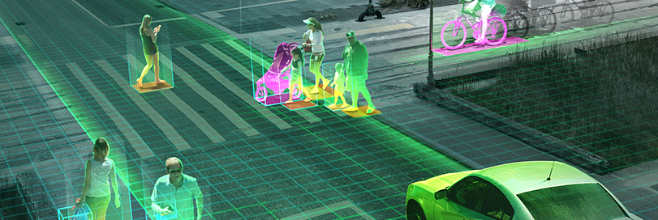

# ComputerVision

These projects include but not limited to facial recognition, facial keypoints detection, automatic image captioning, and landmark detection and localization using SLAM (simultaneous localization and mapping).

**Environment Setup**
Make sure you have Anaconda installed. Then, run conda env create -f environment.yml to install all necessary packages needed for all my projects.

